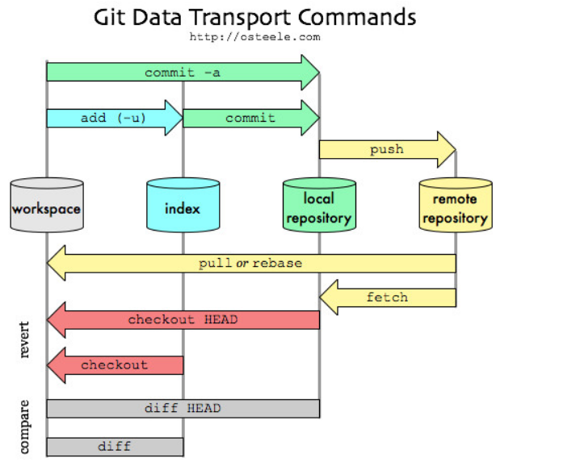

# Overview

This project aims to provide a comprehensive understanding of Git repositories and their components, including the workspace, index, local repository, and remote repository. The motivation behind this project is to simplify the concepts for both new and experienced users, ensuring they can effectively manage their codebase using Git.

# Diagram

# Git Repositories

## Workspace
The workspace, or working directory, is where you modify and create files. This is the directory on your local machine where you make changes to your project files. The files in it can be in an untracked, modified, or deleted state.

### Common Commands
- `git status`: Shows the status of files in the working directory.

## Index (Staging Area)
The index, or staging area, is where you prepare changes before committing them. It acts as a middleman between your working directory and the local repository. It holds snapshots of your changes that will be included in the next commit.

### Common Commands
- `git add <file>`: Adds changes to the staging area.
- `git reset <file>`: Removes changes from the staging area.

## Local Repository
The local repository is where Git stores the history of your project. This is the `.git` directory inside your project folder, containing all commits, branches, and tags. It stores the committed history of your project.

### Common Commands
- `git commit -m "message"`: Commits staged changes to the local repository.
- `git log`: Shows the commit history.

## Remote Repository
A remote repository is a version of your project hosted on the internet or another network, allowing you to collaborate with others. Common hosting services include GitHub, GitLab, and Bitbucket. It serves as a centralized repository for collaboration.

### Common Commands
- `git push <remote> <branch>`: Pushes local commits to the remote repository.
- `git pull <remote> <branch>`: Fetches and merges changes from the remote repository.
- `git clone <url>`: Creates a local copy of a remote repository.

## HEAD
In Git, `HEAD` is a pointer that references the current commit in your repository. It's a critical concept in understanding how Git manages the state of your working directory and your history of commits.

### Current Branch Reference
- `HEAD` points to the latest commit in the currently checked-out branch.
- For example, if you're on the main branch, `HEAD` will point to the latest commit in `main`.

### Detached HEAD State
- When `HEAD` points directly to a specific commit (not a branch), you are in a "detached HEAD" state.
- This can happen if you checkout a specific commit using its hash: `git checkout <commit-hash>`.

### Navigating Commits
- You can use `HEAD` to navigate relative to the current commit.
- `HEAD^` refers to the parent of `HEAD`.
- `HEAD~2` refers to the grandparent of `HEAD` (2 commits before the current one).

### Common Commands
- `git log -1`: Shows the latest commit (the commit where `HEAD` is pointing).
- `git checkout <branch-name>`: Moves `HEAD` to the latest commit of the specified branch.
- `git reset --hard HEAD~1`: Resets the current branch to the previous commit, discarding changes in the working directory and staging area.
