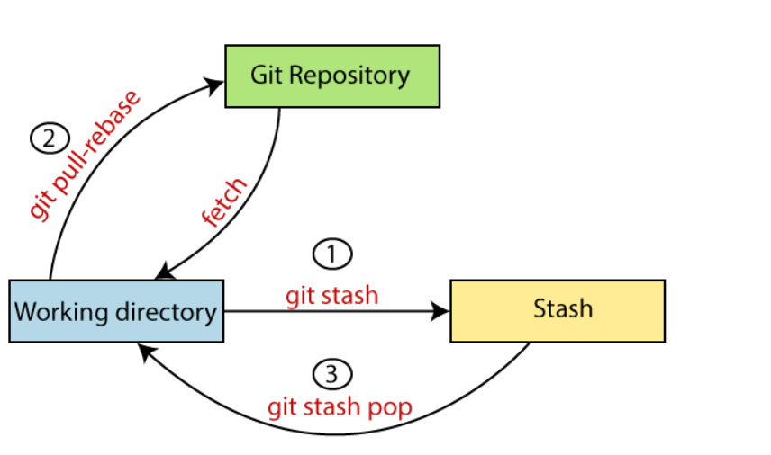
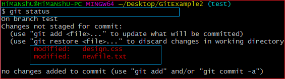
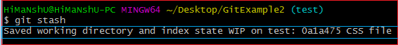

# Using `git stash` in Git: A Practical Example

Sometimes you want to switch the branches, but you are working on an incomplete part of your current project. You don't want to make a commit of half-done work. Git stashing allows you to do so. The git stash command enables you to switch branches without committing the current branch.

The below figure demonstrates the properties and role of stashing concerning repository and working directory.



Generally, the stash's meaning is "store something safely in a hidden place." The sense in Git is also the same for stash; Git temporarily saves your data safely without committing.

Stashing takes the messy state of your working directory, and temporarily save it for further use. Many options are available with git stash. Some useful options are given below:

- Git stash
- Git stash save
- Git stash list
- Git stash apply
- Git stash changes
- Git stash pop
- Git stash drop
- Git stash clear
- Git stash branch

# Stashing Work

Let's understand it with a real-time scenario. I have made changes to my project GitExample2 in two files from two distinct branches. I am in a messy state, and I have not entirely edited any file yet. So I want to save it temporarily for future use. We can stash it to save as its current status. To stash, let's have a look at the repository's current status. To check the current status of the repository, run the git status command. 



From the above output, you can see the status that there are two untracked file design.css and newfile.txt available in the repository. To save it temporarily, we can use the git stash command. 



In the given output, the work is saved with git stash command. We can check the status of the repository.


As you can see, my work is just stashed in its current position. Now, the directory is cleaned. At this point, you can switch between branches and work on them.

# Git Stash Save (Saving Stashes with the message):
In Git, the changes can be stashed with a message. To stash a change with a message, run the below command:
```
$ git stash save "<Stashing Message>"  
```

# Git Stash List (Check the Stored Stashes)
```
$ git stash list  
```

# Git Stash Apply
You can re-apply the changes that you just stashed by using the git stash command. To apply the commit, use the git stash command, followed by the apply option. It is used as:
```
$ git stash apply  
$ git stash apply <stash id>  
$ git stash show  
```

# Git Stash Pop (Reapplying Stashed Changes)
```
$ git stash pop  
```

# Git Stash Drop (Unstash)
```
$ git stash drop  
$ git stash drop <stash id>  
```

# Git Stash Clear
```
$ git stash clear  
```

# Git Stash Branch
If you stashed some work on a particular branch and continue working on that branch. Then, it may create a conflict during merging. So, it is good to stash work on a separate branch.

The git stash branch command allows the user to stash work on a separate branch to avoid conflicts. The syntax for this branch is as follows:
```
$ git stash branch <Branch Name>  
```
The above command will create a new branch and transfer the stashed work on that.  the stashed work is transferred to a newly created branch testing. It will avoid the merge conflict on the master branch.